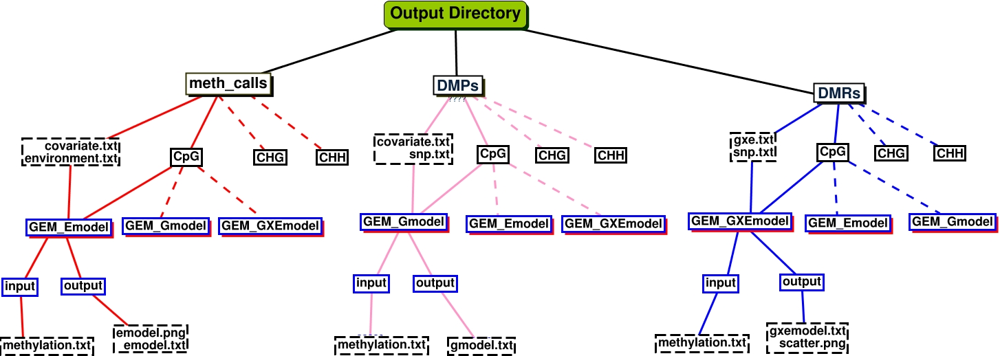

# EpiDiverse-EWAS Output
This document describes the output produced by the pipeline.

## Pipeline overview
The pipeline is built using [Nextflow](https://www.nextflow.io/) and processes data using the following steps:

* [Methylation Calls Input Data](#Methylation-Calls-Input-Data) - Running EWAS analysis with methylation calls
* [DMPs Input Data](#Methylation-Calls-Input-Data) - Running EWAS analysis with DMPs
* [DMRs Input Data](#Methylation-Calls-Input-Data) - Running EWAS analysis with DMRs
* [GEM Model Chosing](#GEM-run-with-chosen-model) - Running EWAS analysis with chosen model
* [Unfiltered EModel Output](#unfiltered-output) - Ouput is not filtered by any of p-value and/or FDR values and is generated       by EModel function.
* [Unfiltered GModel Output](#unfiltered-output) - Ouput is not filtered by any of p-value and/or FDR values and is generated       by EModel function.
* [Unfiltered GXEModel Output](#unfiltered-output) - Ouput is not filtered by any of p-value and/or FDR values and is generated       by EModel function.
* [Filtered Output](#filtered-output) - FIltering based on coverage, FDR and/or p-value.
* [Graphs](#step3) - Generating Q-Q, Manhattan, scatter plots.
* [Pipeline Info](#pipeline-info) - reports from nextflow about the pipeline run

### Output Directory Structure



## Methylation Calls Input Data
Pipeline runs with methylation calls input as default. Other two types inputs, Differentially Methylated Positions (DMPs) or Differentially Methylated Regions (DMRs) can be specified by user.

**Output directory: `wgbs/[methcalls]/`**


## DMPs Input Data
Pipeline runs with methylation calls input as default. Other two types inputs, Differentially Methylated Positions (DMPs) or Differentially Methylated Regions (DMRs) can be specified by user.

**Output directory: `wgbs/[DMPs]/`**


## DMRs Input Data
Pipeline runs with methylation calls input as default. Other two types inputs, Differentially Methylated Positions (DMPs) or Differentially Methylated Regions (DMRs) can be specified by user.

**Output directory: `wgbs/[DMRs]/`**


## GEM Model Chosing
GEM_Gmodel is to create a methQTL genome-wide map. GEM_Emodel  aims to find the association between methylation and environmental factor genome widely. GEM_GxEmodel is to test ability of the interaction of gene and environmental factor to predict DNA methylation level.
**Output directory: `wgbs/[input_type]/[model_name]/input/`**


## Emodel Output

The output of Emodel is a lost for phenotype or environmental factors related to CpG identifiers_position that are potential epigenetic biomarkers.


**Output directory: `wgbs/[input_type]/GEM_Emodel/output/emodel.txt`**

Example `*.emodel.txt` file:

```bash
#cpg            beta                    stats                   pvalue                  FDR
MA_1063600_3380 0.000201348214721003    19.1252478505865        1.9366697826534e-16     1.76740852332208e-09
MA_130823_2338  0.00374034501820006     14.8030798020365        7.06691481350611e-14    3.22463994297191e-07
MA_124616_3396  0.00229308051378857     14.2178616353006        1.74734130014078e-13    5.31542330152315e-07
MA_659042_4763  0.00349331275816753     13.2810848935699        7.92517963527306e-13    1.80813349824787e-06
MA_101037_18934 0.00650347618011456     13.0467326159581        1.17172366089198e-12    2.13863447840995e-06
MA_45879_4444   -0.00204511827706292    -11.3429585756145       2.37823546131811e-11    3.61730366774381e-05

...
```


## Gmodel Output

The output of Gmodel is a list for potential genotype(s) related to CpG identifiers_position.

**Output directory: `wgbs/[input_type]/GEM_Gmodel/output/emodel.txt`**

Example `*.emodel.txt` file:

```bash
##     cpg              snp     beta        stats     pvalue        FDR
## 1 MA_1063600_3380    SNP962  0.17808859  42.28204  1.482360e-111 1.482360e-106
## 2 MA_130823_2338     SNP700 -0.21534752 -18.43573  1.761554e-47  8.807769e-43
## 3 MA_124616_3396     SNP578 -0.15171656 -16.70323  9.169281e-42  3.056427e-37
## 4 MA_659042_4763     SNP690  0.10567235  13.47239  5.237893e-31  1.309473e-26
## 5 MA_101037_18934    SNP589  0.07781375  13.07099  1.112935e-29  2.225870e-25
## 6 MA_45879_4444      SNP703  0.13979006  12.55871  5.390763e-28  8.984606e-24

...
```

## GXEmodel Output

The output of GXEmodel is a list for genotype and environment (or phenotype) related CpG identifiers_position that are potentially be related to them.


**Output directory: `wgbs/[input_type]/GEM_GXEmodel/output/emodel.txt`**

Example `*.emodel.txt` file:

```bash
##     cpg              snp     beta        stats     pvalue        FDR
## 1 MA_1063600_3380    SNP962  0.17808859  42.28204  1.482360e-111 1.482360e-106
## 2 MA_130823_2338     SNP700 -0.21534752 -18.43573  1.761554e-47  8.807769e-43
## 3 MA_124616_3396     SNP578 -0.15171656 -16.70323  9.169281e-42  3.056427e-37
## 4 MA_659042_4763     SNP690  0.10567235  13.47239  5.237893e-31  1.309473e-26
## 5 MA_101037_18934    SNP589  0.07781375  13.07099  1.112935e-29  2.225870e-25
## 6 MA_45879_4444      SNP703  0.13979006  12.55871  5.390763e-28  8.984606e-24

...
```


## Filtering

EWAS run output can be filtered based on p-value and FDR values of CpG identifiers.


## Graphs

Pipeline generates Q-Q plot for pvalues from CpGs with an environment factor, it is produced by GEM_Emodel. The scatter plot shows the methylation as response to the environment for different genotypes, it is produced by GEM_Gmodel. Manhattan plot is generated for all models with p-values of CpG identifiers.

**Output directory: `wgbs/[input_type]/[model_name]/output/emodel.png`**
**Output directory: `wgbs/[input_type]/[model_name]/output/gmodel.png`**
**Output directory: `wgbs/[input_type]/[model_name]/output/manhattan.png`**


## Pipeline Info
Nextflow has several built-in reporting tools that give information about the pipeline run.

**Output directory: `template/`**

* `dag.svg`
  * DAG graph giving a diagrammatic view of the pipeline run.
  * NB: If [Graphviz](http://www.graphviz.org/) was not installed when running the pipeline, this file will be in [DOT format](http://www.graphviz.org/content/dot-language) instead of SVG.
* `report.html`
  * Nextflow report describing parameters, computational resource usage and task bash commands used.
* `timeline.html`
  * A waterfall timeline plot showing the running times of the workflow tasks.
* `trace.txt`
  * A text file with machine-readable statistics about every task executed in the pipeline.
