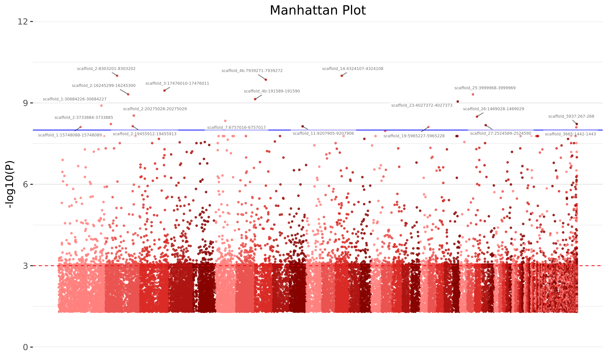

# EpiDiverse-EWAS Output
This document describes the output produced by the pipeline.

## Pipeline overview
The pipeline is built using [Nextflow](https://www.nextflow.io/) and processes data using the following steps:

* [Pre-processing](#pre-processing) -Sample filtering and parsing the samplesheet
* [bedtools unionbedg](#bedtools-unionbedg) -Combining all samples into single files
* [bedtools intersect](#bedtools-intersect) -Intersecting methylated positions based on DMPs and/or DMRs
* [Averaging regions](#averaging-regions) -Calculating average methylation values for given DMRs
* [Processing variants](#processing-variants) -Filtering and merging input variant call file(s)
* [E model](#e-model) -Testing the association between methylated positions on the given environmental trait
* [G model](#g-model) -Generating methQTL maps for methylated positions and corresponding SNPs
* [GxE model](#gxe-model) -Testing the interaction between methQTLs and the associated environmental trait
* [Pipeline Info](#pipeline-info) -Reports from nextflow about the pipeline run

### Output Directory Structure


## Pre-processing
The pipeline requires individual bedGraphs (in each specified methylation context) and a samplesheet with corresponding sample names, environmental trait values, and covariate values in order to run. The samplesheet is processed into the format required to run GEM, and individual sample bedGraphs are filtered according to coverage. If DMP or DMR comparisons are given then these will be filtered for a user-specified significance threshold on positions / regions prior to downstream analysis.

**Output directory: `ewas/input/`**

* `cov.txt`
* `env.txt`
* `gxe.txt`
  * **NB:** Only saved if GxE model is enabled during the pipeline run.


## Bedtools unionbedg
Following sample pre-processing, the entire collection of each input type is merged into single files per each methylation context. From *.bedGraph files each position denotes the methylation value for each input sample, and all files denote the presence/absence of a given position/region for individual samples/comparisons by the use of "NA".

**Output directory: `ewas/input/bed`**

* `{CpG,CHG,CHH}.bedGraph.bed`

```
chrom	start	end	sample1	sample2	sample3	sample4	sample5	sample6	sample7	sample8	sample9
scaffold_53	390	391	0.50	1.00	NA	NA	0.33	1.00	1.00	0.50	0.00
scaffold_53	392	393	NA	1.00	NA	NA	NA	0.00	NA	NA	NA
scaffold_53	581	582	0.66	0.75	1.00	1.00	0.66	1.00	0.66	0.75	1.00
scaffold_53	583	584	0.87	1.00	1.00	1.00	0.75	0.83	0.77	0.71	1.00
scaffold_53	671	672	0.50	1.00	1.00	1.00	1.00	1.00	1.00	1.00	1.00
scaffold_53	673	674	0.87	0.93	0.66	0.50	0.85	0.83	0.90	1.00	1.00
...
```

* `{CpG,CHG,CHH}.DMPs.bed`
  * **NB:** Only saved if DMPs are given during the pipeline run.
* `{CpG,CHG,CHH}.DMRs.bed`
  * **NB:** Only saved if DMRs are given during the pipeline run.

```
chrom   start   end     g1_vs_g2    g1_vs_g3    g2_vs_g3
scaffold_53     166683  166807  NA      NA      0.037
scaffold_53     227390  227644  NA      NA      0.006
scaffold_53     309090  309149  NA      0.000   NA
scaffold_53     309149  309180  0.017   0.000   NA
scaffold_53     309180  309262  0.017   NA      NA
scaffold_53     309535  309715  NA      0.000   0.000
...
```

## Bedtools intersect
If DMPs or DMRs are given as input types, then the respective union files from Bedtools unionbedg are intersected with the entire dataset of individual methylated positions in order to filter them by positions which are contained within significant DMPs and/or DMRs. This reduces the total number of multiple comparisons when running EWAS and improves sensitivity. All files resulting from this process contain methylated positions denoting the respective methylation value for each input sample.

**Output directory: `ewas/positions/`**

* `{CpG,CHG,CHH}.bedGraph.bed`
* `{CpG,CHG,CHH}.DMPs.bed`
  * **NB:** Only saved if DMPs are given during the pipeline run.
* `{CpG,CHG,CHH}.DMRs.bed`
  * **NB:** Only saved if DMRs are given during the pipeline run.


```
chrom	start	end	sample1	sample2	sample3	sample4	sample5	sample6	sample7	sample8	sample9
scaffold_53	390	391	0.50	1.00	NA	NA	0.33	1.00	1.00	0.50	0.00
scaffold_53	392	393	NA	1.00	NA	NA	NA	0.00	NA	NA	NA
scaffold_53	581	582	0.66	0.75	1.00	1.00	0.66	1.00	0.66	0.75	1.00
scaffold_53	583	584	0.87	1.00	1.00	1.00	0.75	0.83	0.77	0.71	1.00
scaffold_53	671	672	0.50	1.00	1.00	1.00	1.00	1.00	1.00	1.00	1.00
scaffold_53	673	674	0.87	0.93	0.66	0.50	0.85	0.83	0.90	1.00	1.00
...
```


## Averaging regions
If DMRs are given as an input type, then the respective union files from Bedtools unionbedg are overlayed with the individual methylated positions in order to calculate the average methylation value for each sample in each region. These independent regions are then given to the EWAS analysis in addition to the standard test on individual positions. If the --merge option is specified then regions which are immediately adjacent to each other are merged prior to calculating the average methylation.

**Output directory: `ewas/regions/`**

* `{CpG,CHG,CHH}.region.bed` or `{CpG,CHG,CHH}.merged.bed`
  * Union bed files containing the average methylation over each region for each input sample.


## Processing variants
If SNPs are given as an input type, then a combination of bcftools and vcftools are given to filter positions and extract a genotype matrix encoded as 1,2,3 for major allele homozygote (AA), heterozygote (AB) and minor allele homozygote (BB) for all SNPs across all samples. The resulting matrix is passed on to "G model" and "GxE model" where appropriate.

**Output directory: `ewas/input/`**

* `snps.txt`
  * Genotype matrix required by GEM.


## E model
The E model tests the association between the methylation value on given positions / regions and the environmental trait value specified for each sample in the samplesheet.

**Output directory: `ewas/{positions,regions}/Emodel`**

* `*.log`
  * The log of the stderr from GEM Emodel
* `*.txt`
  * The full results from GEM Emodel output
* `*.filtered_*_FDR.txt`
  * The results from GEM Emodel filtered by FDR threshold

```
cpg             beta                    stats                   pvalue                  FDR
MA_1063600_3380 0.000201348214721003    19.1252478505865        1.9366697826534e-16     1.76740852332208e-09
MA_130823_2338  0.00374034501820006     14.8030798020365        7.06691481350611e-14    3.22463994297191e-07
MA_124616_3396  0.00229308051378857     14.2178616353006        1.74734130014078e-13    5.31542330152315e-07
MA_659042_4763  0.00349331275816753     13.2810848935699        7.92517963527306e-13    1.80813349824787e-06
MA_101037_18934 0.00650347618011456     13.0467326159581        1.17172366089198e-12    2.13863447840995e-06
MA_45879_4444   -0.00204511827706292    -11.3429585756145       2.37823546131811e-11    3.61730366774381e-05
...
```

* `*.jpg`
  * Q-Q plots on the full results


* `*.png`
  * Manhattan plots on the filtered results




## G model
The G model generates genome-wide methQTL maps to test for an association between the methylation value on given positions / regions and any SNPs which co-occur in each sample. As the matrix of methylated positions vs SNPs is orders of magnitude larger than methylated positions alone, this analysis is divided among individual scaffolds and combined at the end for FDR calculation.

**Output directory: `ewas/{positions,regions}/Gmodel`**

* `*.txt`
  * The full results from GEM Gmodel output
* `*.filtered_*_FDR.txt`
  * The results from GEM Gmodel filtered by FDR threshold

```
cpg                snp     beta        stats     pvalue        FDR
MA_1063600_3380    SNP962  0.17808859  42.28204  1.482360e-111 1.482360e-106
MA_130823_2338     SNP700 -0.21534752 -18.43573  1.761554e-47  8.807769e-43
MA_124616_3396     SNP578 -0.15171656 -16.70323  9.169281e-42  3.056427e-37
MA_659042_4763     SNP690  0.10567235  13.47239  5.237893e-31  1.309473e-26
MA_101037_18934    SNP589  0.07781375  13.07099  1.112935e-29  2.225870e-25
MA_45879_4444      SNP703  0.13979006  12.55871  5.390763e-28  8.984606e-24
...
```

* `*.png`
  * Sequence dotplots indicating the relative positions of SNPs and methylated positions in significant methQTLs


## GxE model
The GxE model tests for the interaction between methQTLs and the environmental trait. As the matrix of methylated positions vs SNPs is orders of magnitude larger than methylated positions alone, this analysis is divided among individual scaffolds and combined at the end for FDR calculation.

**Output directory: `ewas/{positions,regions}/GxE`**

* `*.txt`
  * The full results from GEM GxE model output
* `*.filtered_*_FDR.txt`
  * The results from GEM GxE model filtered by FDR threshold

```
cpg                snp     beta        stats     pvalue        FDR
MA_1063600_3380    SNP962  0.17808859  42.28204  1.482360e-111 1.482360e-106
MA_130823_2338     SNP700 -0.21534752 -18.43573  1.761554e-47  8.807769e-43
MA_124616_3396     SNP578 -0.15171656 -16.70323  9.169281e-42  3.056427e-37
MA_659042_4763     SNP690  0.10567235  13.47239  5.237893e-31  1.309473e-26
MA_101037_18934    SNP589  0.07781375  13.07099  1.112935e-29  2.225870e-25
MA_45879_4444      SNP703  0.13979006  12.55871  5.390763e-28  8.984606e-24
...
```

* `*/*.png`
  * Plots for the top K most significant interactions and the associations with the environmental trait for major allele homozygote (AA), heterozygote (AB) and minor allele homozygote (BB) for all SNPs across all samples.


## Pipeline Info
Nextflow has several built-in reporting tools that give information about the pipeline run.

**Output directory: `template/`**

* `dag.svg`
  * DAG graph giving a diagrammatic view of the pipeline run.
  * NB: If [Graphviz](http://www.graphviz.org/) was not installed when running the pipeline, this file will be in [DOT format](http://www.graphviz.org/content/dot-language) instead of SVG.
* `report.html`
  * Nextflow report describing parameters, computational resource usage and task bash commands used.
* `timeline.html`
  * A waterfall timeline plot showing the running times of the workflow tasks.
* `trace.txt`
  * A text file with machine-readable statistics about every task executed in the pipeline.
